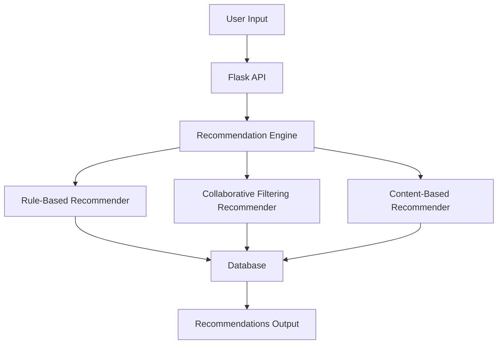
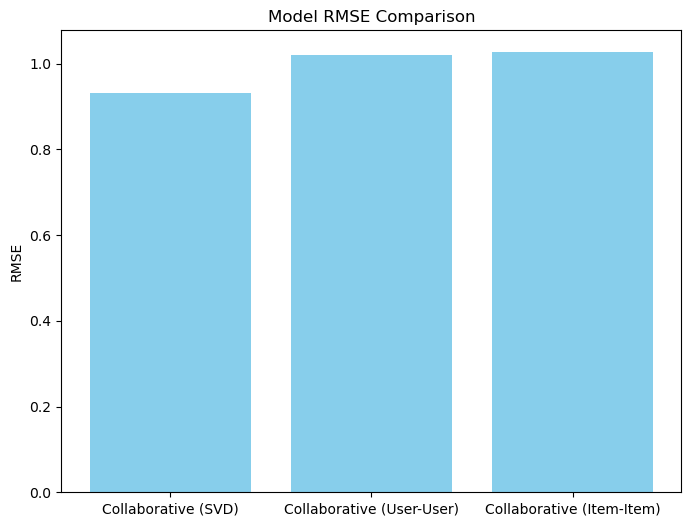
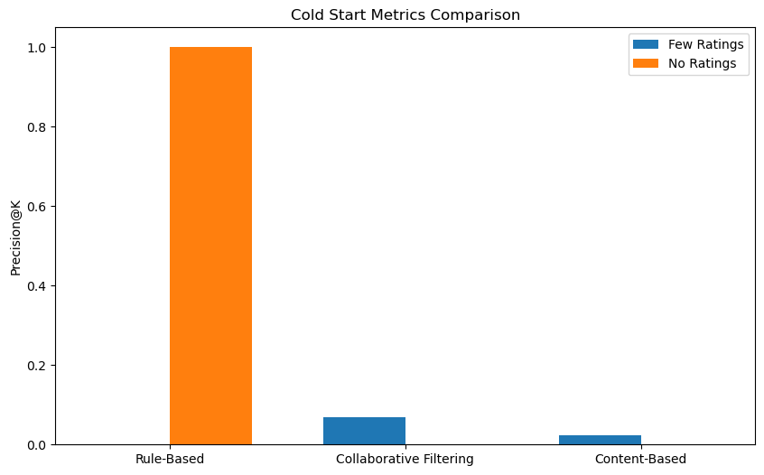
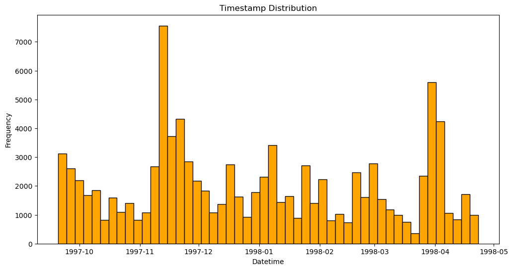
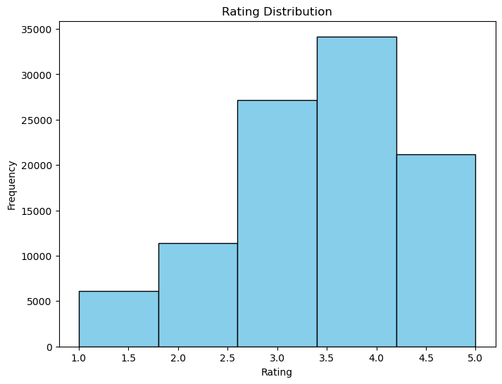

# System_Report.md

## System Design

### Overview
This system is for recommending movies through different techniques, including rule-based, collaborative filtering, and content-based methods. It focuses on adaptability and personalization while addressing challenges like the cold start problem. 
### System Architecture

### Controllable Parameters
1. **Rule-Based Recommendations**:
   - `top_n`: Number of top-rated movies for recommending.
   - `genre`: Specific genre to filter recommendations.

2. **Collaborative Filtering**:
   - `algorithm`: Choose SVD, user-user, or item-item models.
   - `min_support`: Minimum number of interactions to reocmmend.

3. **Content-Based Filtering**:
   - `similarity_metric`: Choose cosine similarity and Jaccard.
   - `features`: Item features like genres or descriptions for similarity.

4. **Partitioning**:
   - `partition_type`: Stratified or temporal sampling.
   - `test_ratio`: Ratio of test to training data.

5. **Cold Start Parameters**:
   - `fallback_model`: Rule-based or content-based for new users.

---

## Metrics Definition

### Offline Metrics
1. **RMSE (Root Mean Square Error)**:
   - Purpose: Measures the error in predicted ratings compared to actual ratings during testing.
   - Usage: Accuracy for collaborative filtering and content-based models.

2. **nDCG (Normalized Discounted Cumulative Gain)**:
   - Purpose: Measures ranking quality by evaluating the recommendations' relevance.
   - Usage: Determines how well recommendations match user preferences.

### Online Metrics
1. **Precision@K**:
   - Purpose: Measures the proportion of top-K recommendations relevant to the user.
   - Usage: Relevance in real-world use.

2. **CTR (Click-Through Rate)**:
   - Purpose: Monitors how often users engage with recommended items.
   - Usage: Practical effectiveness of recommendations.

3. **Engagement Rate**:
   - Purpose: Tracks user interactions over time to detect model drift or user disengagement.
   - Usage: Monitors long-term system effectiveness.

---

## Significant Design Decisions

#### 1. Model Selection for Personalization
- **Significance**: Determines the accuracy and relevance of recommendations.
- **Alternatives**:
  - Rule-Based: Simple and interpretable but lacks personalization.
  - Collaborative Filtering (SVD): Captures user-item interactions but requires sufficient data.
  - Content-Based Filtering: Utilizes item features but may suffer from over-specialization.
- **Evaluation**:
  - RMSE Comparison:

  - Decision: SVD is chosen for its balance of accuracy and personalization.

#### 2. Cold Start Strategy
- **Significance**: Ensures recommendations for new users.
- **Alternatives**:
  - Rule-Based: Recommends top-rated movies.
  - Content-Based: Recommends movies similar to a small set of user-rated items.
- **Evaluation**:

  - Decision: Rule-Based for no ratings; Content-Based for few ratings.

#### 3. Data Partitioning Method
- **Significance**: Affects the training and evaluation of models.
- **Alternatives**:
  - Stratified Sampling: Maintains rating distribution.
  - Temporal Sampling: Simulates real-world scenarios by splitting data chronologically.
- **Evaluation**:
  - Temporal Sampling ensures better simulation of future data.

#### 4. Drift Detection Threshold
- **Significance**: Prevents performance degradation due to outdated models.
- **Alternatives**:
  - Low Threshold: Frequent retraining but high computational cost.
  - High Threshold: Less frequent retraining but risk of outdated models.
- **Evaluation**:
  - Decision: Moderate threshold to balance performance and cost.

#### 5. API Design for Interface Service
- **Significance**: Ensures seamless user interaction.
- **Alternatives**:
  - RESTful APIs: Standard and widely supported.
  - GraphQL APIs: Flexible but complex.
- **Evaluation**:
  - Decision: RESTful APIs for simplicity and compatibility.

---

## Supporting Evidence
1. **Offline Metrics**:
   - RMSE for SVD: `0.9325` (lowest among collaborative methods).
   - Content-Based Precision@K: `0.6`.

2. **Cold Start Precision**:
   - Rule-Based: Effective fallback for no ratings.
   - Content-Based: Highest precision for limited ratings.

3. **Sampling Insights**:
   - Stratified Sampling: Ensures even distribution across users.
   - Temporal Sampling: Simulates live systems.
   
   

4. **Visualizations**:
   - Rating Distribution: Highlights user preferences.
   

---

