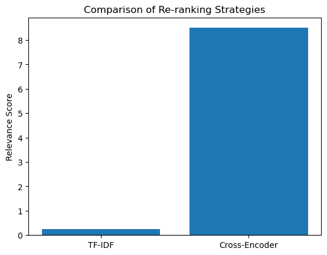

## System Design
### 1. Extraction Service
The extraction service preprocesses documents so that they can be indexed and subsequently retrieved. This service uses two chunking approaches: sentence-based and fixed-length chunking. The `preprocess_corpus()` splits documents into smaller segments and encodes them into embeddings using `all-MiniLM-L6-v2`. Key parameters are:
- `chunking_strategy` (sentence or fixed-length)
- `fixed_length` (for fixed-length chunks)
- `overlap_size` (to maintain context between chunks).
### 2. Retrieval Service
The retrieval service indexes the embeddings created initially using FAISS for a better similarity search, by retrieving the top `k` neighbor for a specific query. The service allows for hybrid re-ranking using TF-IDF and cross-encoding models that allow for better context relevance. Key parameters are:
- `index_type` (e.g., Flat, IVF)
- `k` (number of nearest neighbors retrieved)
- `reranker_strategy` (cross-encoder, TF-IDF, or hybrid).
### 3. Generation Service
The generation service combines the query with the retrieved context and gives an answer with a pre-trained language model by Mistral API. The reranking improves relevance of the response, while the temperature allows for randomness in the generated response. The key parameters are:
- `rerank` (whether reranking is applied)
- `temperature` (randomness of output)
- `generator_model` (model type, e.g., mistral-large-latest).

### 4. Interface Service
The interface service uses RESTful API endpoints and exposes the system to allow for a user to interact. 

## Metrics Definition
Both offline and online metrics were used.
### Offline Metrics
Their purpose is to evaluate performance of the system during development and testing. They help identify weak areas and evaluate the quality of the intermediate steps. These include:
- Accuracy: percentage of correct answers compared to a ground truth dataset 
- Precision@K: relevance of chunks that were retrieved among the top `k` results.
- Latency: the time taken for preprocessing, retrieval, and generation
### Online Metrics
Online metrics evaluate system performance in the live production environment. They include:
- Response Time: time taken to answer a user query
- User Feedback: Collect ratings from users for answer generation.
- Throughput: Number of queries per second

## Analysis and Design Parameters and Configurations
### 1. Extraction Service: Chunking (Decision: sentence-based vs fixed-length)
- Impact: The division strategy for chunking can impact the accuracy of the retrieval as well as context relevance. Smaller chunks are better for precision but they can lose context.
- Alternatives: Particularly, sentence-based chunking, which is the current approach, allows for precise and coherent embeddings, although they are limited to sentence boundaries. Fixed-length is gives more flexibility to independelty segment sentences.
- Evaluation: In `reranker_analysis.ipynb` we tested various chunk sizes with overlap (i.e., `overlap_size=2, 4`) which improved retrieval. Fixed-length chunks with smaller overlaps gave more precise answers for smaller queries.
### 2. Embedding Model - Extraction Service
- Impact: The embedding model decides the retrieval accuracy as well as speed. A smaller model improves speed, but larger models like `all-mpnet-base-v2` have better embeddings.
- Alternatives:There is `MiniLM-L6-v2` which is fast and lightweight but it loses fidelity. `All-mpnet-base-v2` has stronger semantic understanding, on the other hand, but is more computationally expensive.
- Evaluation: The embedding models were tested on queries like "What is the capital of France?" and we compared retrieval precision.
### 3. Indexing Method - Retrieval Service
- Impact: The index type impacts search speed and memory usage. For example, depending on document size, some forms if indexing are more scalable than brute-force.
- Alternatives: `IndexFlat`  is simple and precise but inefficient for large datasets. `IVF` reduces search time in larger datasets through clustering, yet also needs more memory just for the cluster metadata. `HNSW` is a great way to balance speed and memory.
- Evaluation: Comparing the retrieval latency and precision across these three different methods.
### 4. Reranking Strategy - Retrieval Service
- Impact: Reranking is important to improve relevance of the chunks. Cross-encoding is semantically accurate but computationally expensive.
- Alternatives: `TF-IDF` is lightweight and fast but since it is keyword-based, it can lack semantic knowledge. `Cross-Encoder` is great for semantic matching although it is slow in larger datasets. Hybrid approaches can combine both of these.
- Evaluation: `reranker_analysis.ipynb` shows that the cross-encoder outperformed TF-IDF in relevance, although it is slower. This is sensible considering their structure.

### 5. Answer Generation Strategy - Generation Service
- Impact: The generation quality depends on the model size and context of the input. Smaller models are less fluent but can provide speed.
- Alternatives: A small model is fast but can miss some details with complex queries. A large model is more detailed but is computationally expensive.
- Evaluation: We used test responses for queries like "Who was Abraham Lincoln?" across both small and larger models.